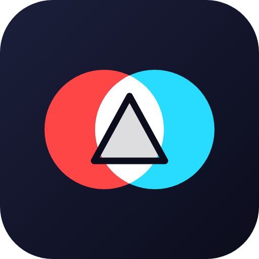
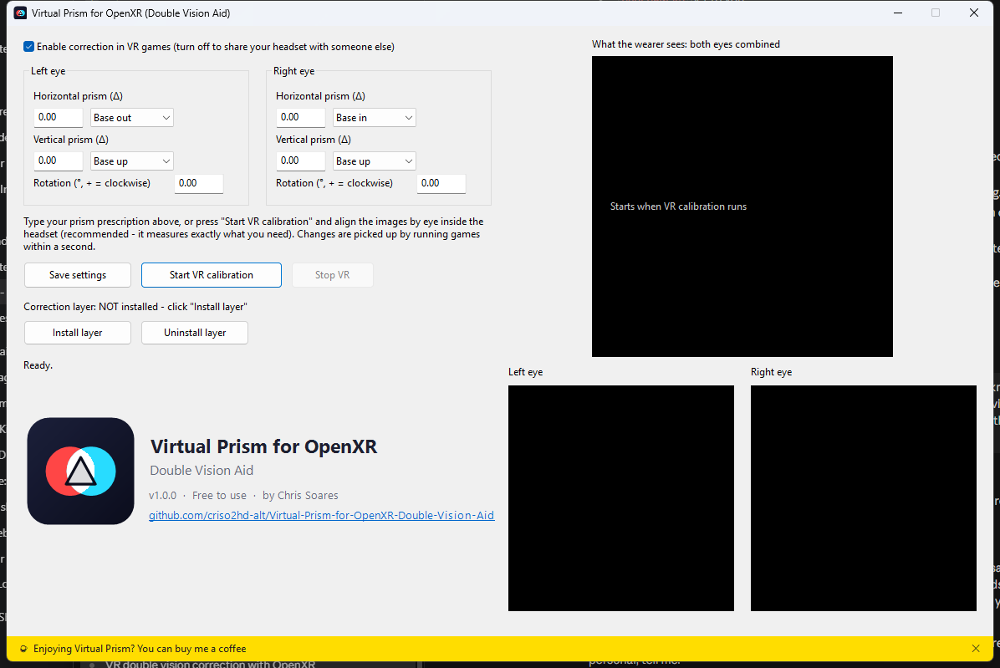

<p align="center"></p>

# Virtual Prism for OpenXR (Double Vision Aid)

A "virtual prism" for VR. If you have double vision (diplopia / strabismus / a paralysed eye muscle) and wear prism glasses in real life but
can't fit prism lenses in your headset, this tool shifts and rotates each eye's image so the two images
line up again - in **any OpenXR game**.

> **Not a medical device.** It does not treat or diagnose anything. Ask your eye doctor about prism
> values, and take breaks if VR is uncomfortable.

<p align="center"></p>

**Download:** get the latest zip from the [Releases page](https://github.com/criso2hd-alt/Virtual-Prism-for-OpenXR-Double-Vision-Aid/releases/latest), unzip it anywhere and run `VirtualPrism.exe`.

## Why this exists
I have been using VR since the Oculus DK2. A few years ago a serious illness left one of my eye muscles
working poorly, and I have had double vision ever since. In real life I wear glasses with prism, but a
headset has no place for them. Custom prism lenses for a VR headset are often impractical, and a pair
can cost as much as the headset itself.

So I built the prism in software. Instead of bending light, Virtual Prism shifts and rotates each eye's
image by the amount you need, and you set it by lining the two images up inside the headset. The first time
I aligned them, my eyes locked on and I saw one clear image again. I'm sharing it, free, in case it helps
other people who love VR and have the same problem.

## How it works
- **API layer** (`XR_APILAYER_NOVENDOR_virtual_prism.dll`): an OpenXR API layer loaded by the OpenXR
  loader into every OpenXR app. It turns each eye's view slightly before the game renders and puts the
  original pose back when the frame is submitted, so the compositor displays that eye's image shifted
  by exactly the correction (horizontal / vertical prism + roll).
- **VirtualPrism.exe**: a settings window (type your prescription, turn the effect on/off, install the
  layer) and an in-headset calibration where you align the two eyes' images with the controllers.

Settings live in `%APPDATA%\VirtualPrismOpenXR\config.ini`. Running games notice changes within a
second, so the on/off checkbox works live (handy when someone else wants to use your headset).

While you calibrate, the desktop window shows a live spectator view of what you see, so a helper can follow along.

## Connecting your headset (Meta Quest 2 / 3)
This tool runs on your **Windows PC** and corrects what the PC sends to the headset, so you need to run your
games from the PC.

1. Install the [Meta Quest Link app](https://www.meta.com/help/quest/articles/headsets-and-accessories/oculus-link/set-up-link/) on your PC and sign in.
2. In the Link app go to **Settings > General** and click **Set Meta Quest Link as active OpenXR runtime**.
3. Connect the headset to the PC, with one of:
   - **Quest Link:** a USB 3 cable, then choose *Quest Link* inside the headset.
   - **Air Link:** PC and headset on the same 5 GHz Wi-Fi; in the headset open *Settings > Quest Link > Air Link*.
   - **Virtual Desktop:** start SteamVR and set it as the active OpenXR runtime in SteamVR's settings.
4. Run `VirtualPrism.exe`, click **Install layer** (once), then **Start VR calibration** and put the headset on.
5. Align the images, hold the right trigger to save, then start your game from the PC.

Good to know:
- It works with games that use **OpenXR** on the PC. Restart a game that was already running when you installed the layer.
- Games that only support SteamVR/OpenVR are not affected; look for an OpenXR option in the game.
- Games installed **on the headset itself** (standalone Quest apps) cannot be corrected. Android does not let one app change
  what another app draws, so a standalone version is not possible. Use the PC.

## Use
1. Run `VirtualPrism.exe`, click **Install layer** (per-user, no admin needed).
2. Optionally type your prescription (prism diopters + base direction) and click **Save settings**.
3. Make sure your headset's OpenXR runtime is active (Meta Quest Link: Settings > General > "Set Meta
   Quest Link as active OpenXR runtime"), connect the headset, click **Start VR calibration**, put it on.
4. In VR, align the images:

| Control | Action |
|---|---|
| Right stick / Left stick | move the right / left eye image |
| A / Y | rotate clockwise (right / left eye) |
| B / X | rotate counter-clockwise (right / left eye) |
| Stick click | reset that eye |
| Left trigger | both eyes / left only / right only |
| Left grip | next scene (the last one is a 3D room) |
| Right grip | step size: coarse / medium / fine |
| Menu button | show / hide help |
| Hold right trigger | save and exit |

5. Start any OpenXR game. Restart games that were already running when you installed the layer.

**3D test room:** the last scene is a small room you can look and walk around in, with a table close to you and
colored frames, posts and floor stripes from 0.7 m to 12 m away. Use it to check the settings with real depth and different
distances; you can still adjust with the sticks while you look around.

**Fine-tune while playing:** keep `VirtualPrism.exe` open and press **Ctrl+Alt+Numpad** (NumLock on): `4`/`6` left/right,
`8`/`2` up/down, `7`/`9` rotate, `5` reset the eye, `0` switch eye, `+` coarse/fine step, `*` turn the correction on/off.
Changes reach the game within half a second.

Units: horizontal/vertical values are prism diopters (1 = 1 cm at 1 m, about 0.57 degrees); rotation is in degrees.

## Limitations
- Only OpenXR apps. Games that talk directly to OpenVR/SteamVR bypass the layer (use their OpenXR mode,
  or SteamVR's OpenXR path where available).
- Only projection layers (the game's 3D view) are corrected, not 2D overlay/quad layers some games use for menus.
- It shifts the image (field of view at the edge of one eye is lost); it does not bend light like a real prism.
- Tested design target: Meta Quest 3 over Quest Link (Touch controllers).

## Build
Requires Visual Studio 2022+ with C++ and CMake. The OpenXR SDK is fetched automatically.
```
cmake -S . -B build -G "Visual Studio 17 2022" -A x64
cmake --build build --config Release
```
Output is in `build\Release` (`VirtualPrism.exe`, the layer DLL + JSON, `openxr_loader.dll`) - keep them together.

## License
Free to use, and the source is open for you to read and to suggest changes via issues and pull requests.
It is **not** open source in the MIT/GPL sense: please do not re-upload or redistribute it, and do not
change the author credit or the support link. See [LICENSE](LICENSE) and [CONTRIBUTING.md](CONTRIBUTING.md).
Download releases only from this repository.

---
Made by Chris Soares. If this helps you, you can [buy me a coffee](https://buymeacoffee.com/criso2hdj).
